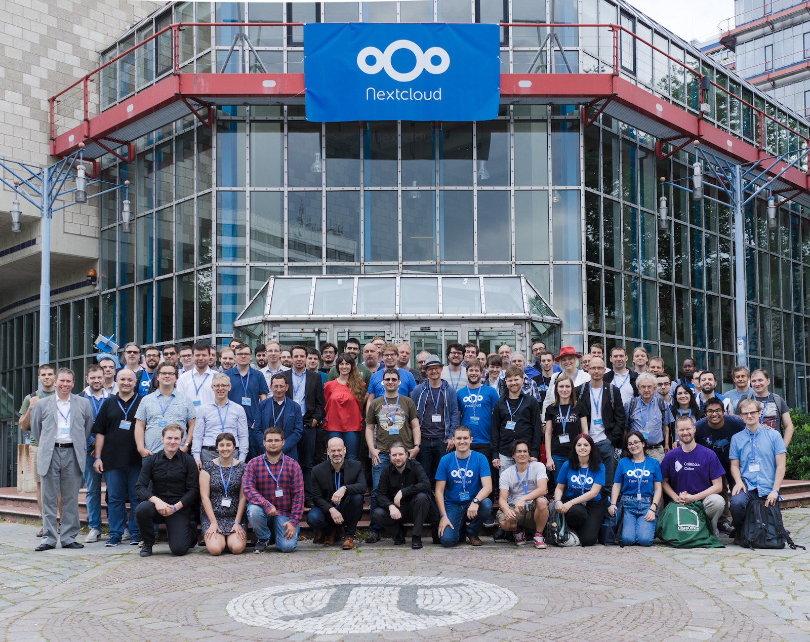
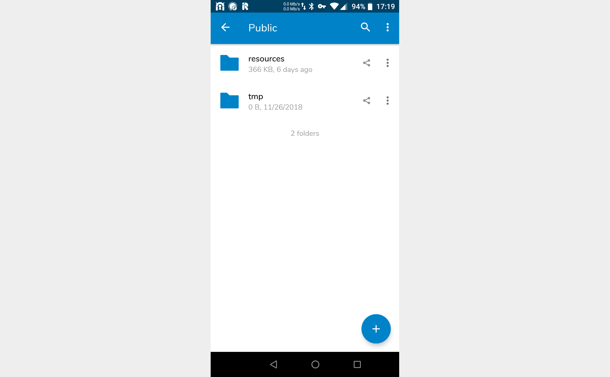
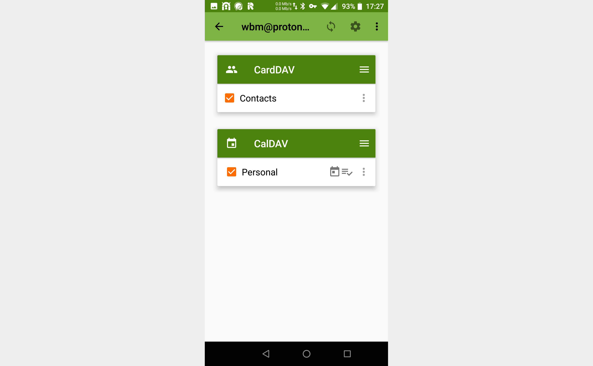

# Nextcloud


# structure of this documentation

Initially there is a quick introduction, then there are a few links for support. After this is a detailed description of the setup of a Nextcloud *server*, which includes notes on the directories of Nextcloud and backup procedures. After this are descriptions of *clients* (such as clients for LineageOS/Android and Ubuntu) that can be used with an existing Nextcloud server.

Note that in this documentation `example.org` is used in place of a domain name or IP address.

If your goal is simply to install and use Nextcloud clients with an existing Nextcloud server, then you are advised to read the [introduction](#introduction) and [support](#support) sections, and then to skip to the [Nextcloud clients](#nextcloud-clients) section.

# introduction

Nextcloud is a suite of client-server software for creating and using file hosting services. It is functionally similar to Dropbox but is FOSS. It was developed originally as ownCloud by Frank Karlitschek. A fork of ownCloud is in use at CERN known as [CERNBox](https://cernbox.web.cern.ch).

In file hosting, public URLS of files can be created and data can be shared by defining permissions for users and groups.

Nextcloud files are stored in conventional filesystem directory structures. Nextcloud can be used not only for file hosting, but for calendar management (CalDAV), contacts (CardDAV) and other things. It features a text editor, a bookmarking service, a URL shortener, an RSS feed reader and some document viewer tools by default, and a wealth of additional applications that can be added optionally.

Video of Nextcloud Android client:

[](https://www.youtube.com/watch?v=4oY7R14Ydno)

# support

- [Nextcloud community forums](https://help.nextcloud.com/)
- [Nextcloud IRC chat channel on freenode.net](https://riot.im/app/#/room/#freenode_#nextcloud:matrix.org)
- [user manual](https://docs.nextcloud.com/server/14/go.php?to=user-)
- [administrator manual](https://docs.nextcloud.com/server/14/go.php?to=admin-)



# setup of Nextcloud server 14.0.3 on Ubuntu 18.04 2018-11-07T2345Z

The Nextcloud server is written in PHP and JavaScript. It can use several database management systems, including SQLite, MariaDB, MySQL and PostgreSQL.

Note that in this documentation strings of "X"s are used in place of usernames and passcodes.

The Nextcloud archive should be extracted to a directory to which the web server software has access.

## SQL database and Apache web server

Set up the SQL database infrastructure. MySQL is used here. SQLite is an alternative. Then, check the status of the database server.

```Bash
apt install mysql-server
systemctl status mysql
```

MySQL can be restarted using a command like `systemctl restart mysql`.

Install the Apache web server, then check the status of Apache, and then check that its default web page (`/var/www/html/index.html`) is accessible via browser.

```Bash
apt install apache2
systemctl status apache2
```

Apache can be restarted etc. in a way like the following:

```Bash
systemctl restart apache2
```

- [guide to Apache configurations](https://www.digitalocean.com/community/tutorials/how-to-install-the-apache-web-server-on-ubuntu-16-04)

Secure MySQL. Initially you are asked to configure how strong the passcodes of users should be. Here we assume that the user is using sufficiently strong passcodes, so just select `Enter` or any key that is not for `yes`. Next you are asked to set a passcode for the MySQL root user. Once this is done, you are asked to remove the anonymous users, restrict root user access to the local machine and to remove the test database. You are asked also to reload the server such that changes take effect. Answer `yes` to all of these questions.

```Bash
mysql_secure_installation
```

Now test login as root on MySQL. This does not require a passcode. You are presented with the MySQL shell.

```Bash
mysql
```

Create a database called `nextcloud`, a username `nextclouduser`, and then and grant all necessary permissions to this user using the following SQL commands:

```SQL
CREATE DATABASE nextcloud CHARACTER SET utf8mb4 COLLATE utf8mb4_general_ci;
GRANT ALL ON nextcloud.* TO 'nextclouduser'@'localhost' IDENTIFIED BY 'XXXXXXXXXXXXXXXXXXXXXXXXXXXXXXXXXXXX';
FLUSH PRIVILEGES;
EXIT;
```

Nextcloud is a PHP application. The default PHP version 7.2 that is installed by Ubuntu 18.04 is not supported by Nextcloud. PHP 7.1 is needed, so install it and a few common PHP modules using the Ondrej PHP repository, then verify that the appropriate PHP version is installed:

```Bash
apt install software-properties-common
add-apt-repository ppa:ondrej/php

apt install libapache2-mod-php7.1\
            php7.1               \
            php7.1-cli           \
            php7.1-common        \
            php7.1-curl          \
            php7.1-gd            \
            php7.1-imagick       \
            php7.1-intl          \
            php7.1-json          \
            php7.1-mbstring      \
            php7.1-mcrypt        \
            php7.1-mysql         \
            php7.1-opcache       \
            php7.1-xml           \
            php7.1-zip

php -v
```

## firewall

A properly-configured firewall is one of the most important aspects of overall system security. By default Ubuntu comes configured with a firewall configuration tool called UFW (Uncomplicated Firewall). It is a user-friendly front-end for managing iptables filewall rules and its main goal is to make managing iptables easier. By default, UFW is installed but inactive. Its default policies are to block all incoming connections and to allow all outbound connections. The default policies are defined in `/etc/default/ufw`. Ensure that it is installed, check its status and then make a backup of its default policies.

```Bash
apt install ufw
ufw status verbose
cp /etc/default/ufw ~/ufw.bak
```

UFW commands are of the following form:

```Bash
ufw default <policy> <chain>
```

When installing a package using `apt`, an application profile that describes the services and contains UFW settings is added at `/etc/ufw/applications.d/`. UFW can list the application profiles using the command `ufw app list`. More detailed information on an application profile is accessible:

```Bash
# ufw app info 'Apache Full'
Profile: Apache Full
Title: Web Server (HTTP,HTTPS)
Description: Apache v2 is the next generation of the omnipresent Apache web
server.

Ports:
  80,443/tcp
```

This profile opens ports 80 and 443. For Nextcloud, the "Apache Full" profile needs to open HTTP (80) and HTTPS (443) ports. As shown, these are already open, but if they were not, they could be opened in the following way, which tells UFW to enable that "Apache Full" profile:

```Bash
ufw allow 'Apache Full'
```

Download the Nextcloud archive and unzip it to `/var/www/`:

```Bash
cd /tmp
wget https://download.nextcloud.com/server/releases/nextcloud-14.0.3.zip
unzip nextcloud-14.0.3.zip
mv /tmp/nextcloud /var/www/
rm nextcloud-14.0.3.zip
```

Set the correct filesystem permissions such that the Apache web server can have full access to the Nextcloud files and directories. Apache must also have access to other directories at which larger stores of data will be.

```Bash
chown -R www-data: /var/www/nextcloud
mkdir /home/nextcloud_data
chown -R www-data: /home/nextcloud_data
```

Create an Apache configuration file for Nextcloud and open it.

```Bash
touch /etc/apache2/conf-available/nextcloud.conf
nano  /etc/apache2/conf-available/nextcloud.conf
```

Add to this Apache configuration file the following Nextcloud profile:

```
Alias /nextcloud "/var/www/nextcloud/"

<Directory /var/www/nextcloud/>
  Options +FollowSymlinks
  AllowOverride All

 <IfModule mod_dav.c>
  Dav off
 </IfModule>

 SetEnv HOME /var/www/nextcloud
 SetEnv HTTP_HOME /var/www/nextcloud

</Directory>
```

Enable this new Apache configuration and all required Apache modules, and then restart Apache to activate the changes.

```Bash
a2enconf nextcloud # disabled by default
a2enmod  rewrite   # disabled by default
a2enmod  headers   # disabled by default
a2enmod  env       # enabled by default
a2enmod  dir       # enabled by default
a2enmod  mime      # enabled by default

systemctl reload apache2
```

Nextcloud should now be accessible as an administration page on the web server.

- <http://example.org/nextcloud>

Enter a desired administrator username and a passcode for it, then enter the MySQL username and database details defined earlier.

- Nextcloud administrator username: XXXXX
- Nextcloud administrator passcode: XXXXXXXXXXXXXXXXXXXXXXXXXXXXXXXXXXXX
- Nextcloud data directory: `/var/www/nextcloud/data`
- database username: nextclouduser
- database passcode: XXXXXXXXXXXXXXXXXXXXXXXXXXXXXXXXXXXX
- database name: nextcloud
- database host: localhost

Leaving the localhost entry port empty by default is fine.

These details are saved to the file `/var/www/nextcloud/config/config.php`, which should be backed up in some secure way.

After entering the details, select the "Finish setup" button. It may take a couple of minutes, but you should then be redirected to the Nextcloud dashboard, logged in as an administrator user. After this administrator step is completed, the initial Nextcloud server web page changes to a simple login page. (which does not feature a register option, only a login option). Now new users can be added by this administrator.

Users can now be created by the administrator, and e-mail addresses can be used to empower a user to reset a passcode.

With a domain name associated with the Nextcloud server, a Let's Encrypt certificate can be used with Apache using Certbot.

- <https://linuxize.com/post/secure-apache-with-let-s-encrypt-on-ubuntu-18-04/>

Until then, a client, such as the Android client, needs the server address specified in a way like the following:

```
http://username@example.org/nextcloud
```

## change directory of Nextcloud data storage directory for space reasons

For a default 18.04 LTS installation, using the web directory for the Nextcloud data storage may result in space becoming a problem briskly:

```Bash
# df -h
Filesystem      Size  Used Avail Use% Mounted on
udev             16G     0   16G   0% /dev
tmpfs           3.2G  940K  3.2G   1% /run
/dev/sda3        20G   19G     0 100% /
tmpfs            16G     0   16G   0% /dev/shm
tmpfs           5.0M     0  5.0M   0% /run/lock
tmpfs            16G     0   16G   0% /sys/fs/cgroup
/dev/sda4       1.8T   68M  1.7T   1% /home
/dev/sda2       487M   79M  379M  18% /boot
tmpfs           3.2G     0  3.2G   0% /run/user/0
```

So the idea is to move the Nextcloud data directory to `/home/nextloud_data` on a partition with plenty of space. In making this change, stop Apache, then move *only* the Nextcloud *data* directory to a partition with enough space.

If necessary (i.e. if the directory exists, do the following) otherwise `mkdir -p /home/nextcloud_data`:

```Bash
sudo systemctl stop apache2
mv /var/www/nextcloud/data /home/nextcloud_data
```

Reconfigure Nextcloud such that it knows its data directory.

```Bash
nano /var/www/nextcloud/config/config.php
```

So, specifically change the appropriate line to the following

```PHP
  'datadirectory' => '/home/nextcloud_data',
```

Also add the following line to the configuration:

```PHP
  'filelocking.enabled' => false,
```

Set the correct filesystem permissions such that Apache has full access to the Nextcloud files and directories.

```Bash
chown -R www-data: /home/nextcloud_data
```

Restart Apache.

```Bash
systemctl start apache2
```

## Where is Nextcloud on the server? What are the important directories?

The structure of the database directory is of the following form:

```Bash
root@gs:/home/nextcloud_data# ls -al
total 36932
drwxrwx---  6 www-data www-data     4096 Nov  9 05:08 .
drwxr-xr-x  9 root     root         4096 Nov  9 04:18 ..
drwxr-xr-x 10 www-data www-data     4096 Nov  9 05:03 appdata_xxxxxxxxxxxx
drwxr-xr-x  2 www-data www-data     4096 Nov  9 05:03 files_external
-rw-r--r--  1 www-data www-data      324 Nov  9 04:58 .htaccess
-rw-r--r--  1 www-data www-data        0 Nov  9 04:58 index.html
drwxr-xr-x  4 www-data www-data     4096 Nov 12 04:31 ncadmin
-rw-r-----  1 www-data www-data 37777854 Jan 24 17:46 nextcloud.log
-rw-r--r--  1 www-data www-data        0 Nov  9 04:58 .ocdata
drwxr-xr-x  7 www-data www-data     4096 Nov 11 05:13 username_1
```

The structure of the Nextcloud server code directory is of the following form:

```Bash
root@gs:/var/www/nextcloud# ls -al
total 168
drwxr-xr-x 15 www-data www-data  4096 Jan 22 03:09 .
drwxr-xr-x  4 root     root      4096 Nov  9 04:17 ..
drwxr-xr-x 33 www-data www-data  4096 Oct 12 06:50 3rdparty
drwxr-xr-x 42 www-data www-data  4096 Jan 23 07:24 apps
-rw-r--r--  1 www-data www-data 12063 Oct 12 06:47 AUTHORS
drwxr-xr-x  2 www-data www-data  4096 Jan 22 03:12 config
-rw-r--r--  1 www-data www-data  3650 Oct 12 06:47 console.php
-rw-r--r--  1 www-data www-data 34520 Oct 12 06:47 COPYING
drwxr-xr-x 18 www-data www-data  4096 Oct 12 06:50 core
-rw-r--r--  1 www-data www-data  4979 Oct 12 06:47 cron.php
drwxr-xr-x  2 www-data www-data  4096 Nov  9 04:27 data
-rw-r--r--  1 www-data www-data  2823 Nov  9 04:58 .htaccess
-rw-r--r--  1 www-data www-data   179 Oct 12 06:47 index.html
-rw-r--r--  1 www-data www-data  3171 Oct 12 06:47 index.php
drwxr-xr-x  6 www-data www-data  4096 Oct 12 06:47 lib
-rw-r--r--  1 www-data www-data   283 Oct 12 06:47 occ
drwxr-xr-x  2 www-data www-data  4096 Oct 12 06:47 ocm-provider
drwxr-xr-x  2 www-data www-data  4096 Oct 12 06:47 ocs
drwxr-xr-x  2 www-data www-data  4096 Oct 12 06:47 ocs-provider
-rw-r--r--  1 www-data www-data  2971 Oct 12 06:47 public.php
-rw-r--r--  1 root     root       756 Nov  9 04:46 ql
-rw-r--r--  1 www-data www-data  5139 Oct 12 06:47 remote.php
drwxr-xr-x  4 www-data www-data  4096 Oct 12 06:47 resources
-rw-r--r--  1 www-data www-data    26 Oct 12 06:47 robots.txt
drwxr-xr-x 12 www-data www-data  4096 Oct 12 06:48 settings
-rw-r--r--  1 www-data www-data  2232 Oct 12 06:47 status.php
drwxr-xr-x  3 www-data www-data  4096 Oct 12 06:47 themes
drwxr-xr-x  2 www-data www-data  4096 Oct 12 06:48 updater
-rw-r--r--  1 www-data www-data   163 Oct 12 06:47 .user.ini
-rw-r--r--  1 www-data www-data   362 Oct 12 06:50 version.php
```

There is also the Apache2 configuration file for Nextcloud at `/etc/apache2/conf-available/nextcloud.conf`.

## backing up Nextcloud

Change to a backup directory and then rsync Nextcloud configurations, code and data.

```Bash
time rsync -avzP root@www.example.org:/etc/apache2/conf-available/nextcloud.conf .
time rsync -avzP root@www.example.org:/var/www/nextcloud                         .
time rsync -avzP root@www.example.org:/home/nextcloud_data                       .
```

## setup of Nextcloud applications

### install Nextcloud applications Calendar and Contacts

- Nextcloud documentation:
    - <https://docs.nextcloud.com/server/14/user_manual/pim/contacts.html>
    - <https://docs.nextcloud.com/server/14/user_manual/pim/sync_android.html>

In the Nextcloud web interface as the administrator, install the official Nextcloud applications Contacts and Calendar. These should be accessible at URLs of the following forms:

- <http://example.org/nextcloud/index.php/settings/apps/organization/calendar>
- <http://example.org/nextcloud/index.php/settings/apps/organization/contacts>

---

# Nextcloud clients

## setup of Nextcloud clients

- [clients user manual](https://docs.nextcloud.com/server/14/user_manual/)

### LineageOS/Android Nextcloud client

- [Nextcloud client on F-Droid](https://f-droid.org/packages/com.nextcloud.client/)
- [Nextcloud client on Google Play](https://play.google.com/store/apps/details?id=com.nextcloud.client)



On setup, the URL of the Nextcloud server is needed (e.g. `http://example.org/nextcloud`) and user credentials.

### Ubuntu Nextcloud client

- [GNU/Linux desktop client](https://nextcloud.com/install/#install-clients)
- <https://launchpad.net/~nextcloud-devs/+archive/ubuntu/client>

```Bash
sudo add-apt-repository ppa:nextcloud-devs/client
sudo apt update
sudo apt install nextcloud-client
```

Launch the application "Nextcloud desktop sync client" and configure it. Note particularly if the server is using HTTP or HTTPS.

- server address: http://example.org/nextcloud
- username: XXXXXXX
- passcode: XXXXXXXXXXXXXXXXXXXXXXXXXXXXXXXXXXXX

Now, you can configure precisely how and what to sync. Similarly to Dropbox, there is suggested the default directory of `~/Nextcloud`.

- Sync everything from server: yes
- Ask for confirmation before synchronizing folders larger than <500> MB: no
- Ask for confirmation before synchronizing external storages: yes

## usage of Nextcloud clients

### client usage Android

The Android client can back up contacts. The Auto upload settings can enable automatic upload of photographs and the like. By default these are stored at the Nextcloud directory `InstantUpload` (with subdirectories at that).

### client usage Ubuntu

It should launch at startup or be accessible from the launcher as "Nextcloud desktop sync client". The panel icon gives settings options etc. It is basically similar to Dropbox but more informative and user-friendly.

# usage of Nextcloud applications

Now there are a few options that can be taken beyond installing clients. For examples, Nextcloud can be an alternative to Google Calendar and Google Contacts.

- [connect calendar](https://docs.nextcloud.com/server/14/go.php?to=user-sync-calendars)
- [connect contacts](https://docs.nextcloud.com/server/14/go.php?to=user-sync-contacts)
- [access files via WebDAV](https://docs.nextcloud.com/server/14/go.php?to=user-webdav)

## calendar and contacts, with LineageOS/Android as an example client platform and Google Calendar and Google Contacts as sources

### export Google Calendar

Access Google Calendar and export the calendars. As of 2019-01-23, this results in a ZIP file containing a separate iCalendar (`.ics`) file for each calendar.

### export Google Contacts

Access GMail and export contacts to Virtual Contact File format (`.vcf`). As of 2019-01-23, it may be necessary to access the "old" version of GMail to do this.

### import calendars to Nextcloud

In the Nextcloud web interface as a personal user, access the calendar application (which should be visible as an icon in the top panel). Select "Settings & import", then select "Import calendar" and import a calendar in the iCalendar (`.ics`) format. When this import is complete, take note of the primary CalDAV URL, which should be of a form like the following:

- <http://example.org/nextcloud/remote.php/webdav/>

### import contacts to Nextcloud

In the Nextcloud web interface as a personal user, access the contacts application (which should be visible as an icon in the top panel). Select "Settings", then select "Import into Contacts" and import contacts in the Virtual Contact File format (`.vcf`).

### install and set up DAVx5

On LineageOS/Android, install DAVx5, which is a CalDAV/CardDAV management and synchronization application which integrates with default LineageOS/Android calendar and contacts applications.

- [DAVx5 on F-Droid](https://f-droid.org/en/packages/at.bitfire.davdroid)
- [DAVx5 on Google Play](https://play.google.com/store/apps/details?id=at.bitfire.davdroid)

Run DAVx5. Create a new account on it with an e-mail address as the DAVx5 account name and then enter the CalDAV URL. There are various configurations possible, for example rates at which calendars and contacts are synchronised etc.

- <https://docs.nextcloud.com/server/14/user_manual/pim/sync_android.html>


